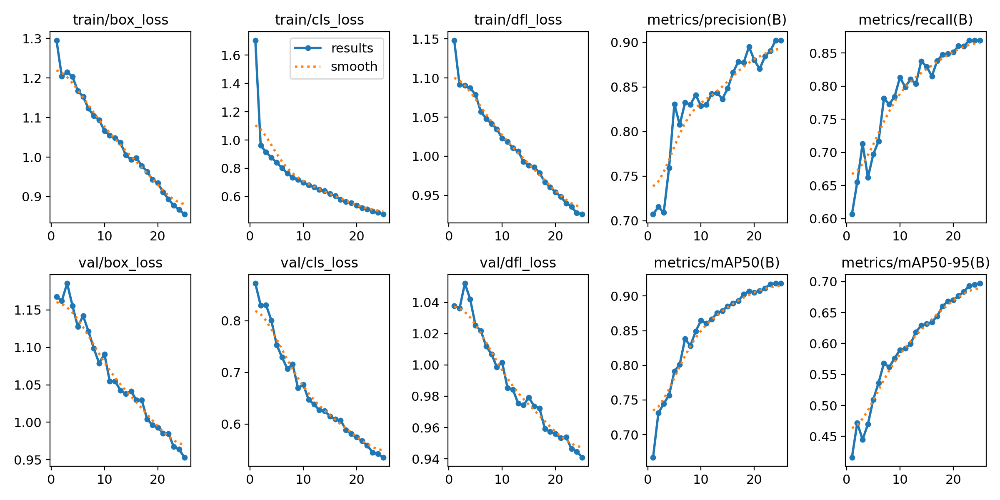
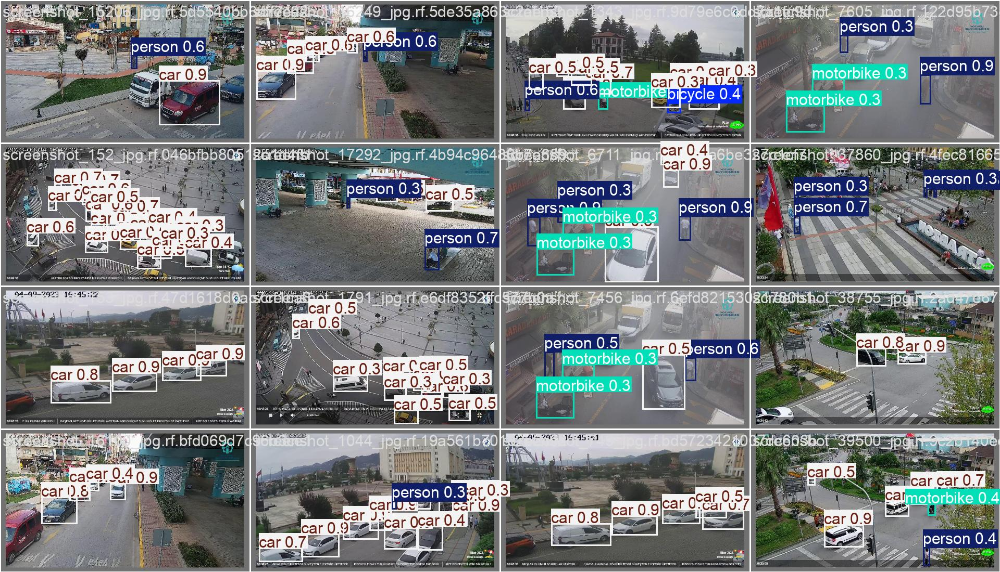

# Trustworthiness Evaluation: AI-Powered Traffic Management System

**Course:** CIS 6930 Trustworthy AI Systems  
**Group 24:** Suma Vatturi (U44064470), RamaKrishna Reddy Vennam (U85778186)  
**Project Repository:** https://github.com/suma-vatturi/Trustness-Evaluation-Traffic-Management-System  

## Table of Contents
- [Trustworthiness Evaluation: AI-Powered Traffic Management System](#trustworthiness-evaluation-ai-powered-traffic-management-system)
  - [Table of Contents](#table-of-contents)
  - [1. Introduction](#1-introduction)
  - [2. Running Evaluation Notebooks Locally](#2-running-evaluation-notebooks-locally)
    - [2.1. Environment Setup](#21-environment-setup)
    - [2.2. Dataset Preparation](#22-dataset-preparation)
    - [2.3. Running the Notebooks](#23-running-the-notebooks)
  - [3. Trustworthiness Principles \& Evaluation Strategy](#3-trustworthiness-principles--evaluation-strategy)
    - [3.1 Reliability \& Robustness Evaluation](#31-reliability--robustness-evaluation)
      - [3.1.1 Perturbation Types](#311-perturbation-types)
      - [3.1.2 Evaluation Metrics](#312-evaluation-metrics)
      - [3.1.3 Evaluation Process](#313-evaluation-process)
    - [3.2 Fairness \& Bias Evaluation](#32-fairness--bias-evaluation)
      - [3.2.1 Class Categories](#321-class-categories)
      - [3.2.2 Fairness Metrics](#322-fairness-metrics)
      - [3.2.3 Evaluation Process](#323-evaluation-process)
  - [4. Methodology \& Implementation](#4-methodology--implementation)
    - [4.1 Model Architecture \& Training](#41-model-architecture--training)
    - [4.2 Robustness Testing Implementation](#42-robustness-testing-implementation)
      - [4.2.1 Image Transformation Functions](#421-image-transformation-functions)
      - [4.2.2 Evaluation Pipeline](#422-evaluation-pipeline)
      - [4.2.3 Statistical Validity](#423-statistical-validity)
    - [4.3 Fairness Testing Implementation](#43-fairness-testing-implementation)
      - [4.3.1 Per-Class Evaluation](#431-per-class-evaluation)
      - [4.3.2 Confusion Matrix Analysis](#432-confusion-matrix-analysis)
  - [5. Results \& Analysis](#5-results--analysis)
    - [5.1 Robustness Results](#51-robustness-results)
      - [5.1.1 Detection Stability Analysis](#511-detection-stability-analysis)
      - [5.1.2 Precision-Recall Trade-offs](#512-precision-recall-trade-offs)
      - [5.1.3 FP/FN Analysis](#513-fpfn-analysis)
    - [5.2 Fairness Results](#52-fairness-results)
      - [5.2.1 Performance Hierarchy Analysis](#521-performance-hierarchy-analysis)
      - [5.2.2 Equity Gap Analysis](#522-equity-gap-analysis)
      - [5.2.3 Confusion Matrix Insights](#523-confusion-matrix-insights)
  - [6. Implications \& Recommendations](#6-implications--recommendations)
    - [6.1 Robustness Improvement Strategies](#61-robustness-improvement-strategies)
      - [6.1.1 Data Augmentation Enhancements](#611-data-augmentation-enhancements)
      - [6.1.2 Architectural Improvements](#612-architectural-improvements)
      - [6.1.3 Operational Safeguards](#613-operational-safeguards)
    - [6.2 Fairness Enhancement Approaches](#62-fairness-enhancement-approaches)
      - [6.2.1 Dataset Improvements](#621-dataset-improvements)
      - [6.2.2 Model Adjustments](#622-model-adjustments)
      - [6.2.3 Post-Processing Strategies](#623-post-processing-strategies)
  - [7. Technical Implementation \& Usage](#7-technical-implementation--usage)
    - [7.1 Requirements \& Dependencies](#71-requirements--dependencies)
    - [7.2 Repository Structure](#72-repository-structure)
    - [7.3 Execution Steps](#73-execution-steps)
      - [7.3.1 Data Preparation](#731-data-preparation)
      - [7.3.2 Model Training](#732-model-training)
      - [7.3.3 Robustness Evaluation](#733-robustness-evaluation)
      - [7.3.4 Fairness Evaluation](#734-fairness-evaluation)
    - [7.4 Reproducibility Notes](#74-reproducibility-notes)
  - [8. Conclusion \& Future Work](#8-conclusion--future-work)
    - [8.1 Summary of Findings](#81-summary-of-findings)
    - [8.2 Deployment Considerations](#82-deployment-considerations)
    - [8.3 Future Research Directions](#83-future-research-directions)
  - [9. Acknowledgments \& References](#9-acknowledgments--references)
    - [9.1 External Code \& Libraries](#91-external-code--libraries)
    - [9.2 Datasets](#92-datasets)
    - [9.3 References](#93-references)

## 1. Introduction

Modern intelligent transportation systems increasingly rely on AI for real-time traffic management. While these systems promise improved efficiency, their deployment in safety-critical infrastructure demands rigorous trustworthiness evaluation. Our project evaluates an AI-driven traffic signal system that detects vehicles and adapts signal timings in real-time, focusing on two crucial trustworthiness principles:

- **Reliability & Robustness:** How well does our system maintain detection performance when confronted with real-world perturbations like adverse weather, lighting changes, or motion blur?
- **Fairness & Bias:** Does our system detect all types of road users equally well, or does it favor certain vehicle types at the expense of others (particularly vulnerable road users)?

These principles are essential because:
1. Traffic systems must operate 24/7 in unpredictable conditions
2. Equitable treatment of all road users is a fundamental safety and ethical requirement
3. Biased or unstable systems could lead to unfair traffic signal timing or even safety incidents

For this evaluation, we utilize YOLOv8s rather than YOLOv9 (used in our midterm) because:
- It integrates more seamlessly with established evaluation libraries
- It provides consistent, reproducible results across environments
- While slightly less accurate than YOLOv9, its performance characteristics are better documented

We also used a cleaner dataset of 3,649 unaugmented Street-View images (versus the 8,693 augmented images in our midterm) to obtain more realistic assessments of the system's true capabilities without artificial enhancement from data augmentation.

## 2. Running Evaluation Notebooks Locally

This section explains how to run our evaluation notebooks on your local machine.

### 2.1. Environment Setup

1. **Clone the repository**
   ```bash
   git clone https://github.com/suma-vatturi/Trustness-Evaluation-Traffic-Management-System.git
   cd Trustness-Evaluation-Traffic-Management-System
   ```

2. **Create a virtual environment**
   ```bash
   # Using conda
   conda create -n traffic-trust python=3.8
   conda activate traffic-trust
   
   # Or using venv
   python -m venv traffic-trust
   # On Windows
   traffic-trust\Scripts\activate
   # On Linux/Mac
   source traffic-trust/bin/activate
   ```

3. **Install dependencies**
   ```bash
   pip install -r requirements.txt
   ```

### 2.2. Dataset Preparation

1. **Download the Street-View dataset**
   
   Option 1: Using Roboflow API (requires account)
   ```python
   from roboflow import Roboflow
   rf = Roboflow(api_key="YOUR_API_KEY")  # Replace with your API key
   project = rf.workspace("sumavatturi").project("street-view-gdogo-a7du4")
   version = project.version(1)
   dataset = version.download("yolov9")
   ```
   
   Option 2: Direct download (if available)
   ```bash
   wget https://github.com/suma-vatturi/Trustness-Evaluation-Traffic-Management-System/releases/download/v1.0/Street-View-1.zip
   unzip Street-View-1.zip -d datasets/
   ```

2. **Verify dataset structure**
   ```
   datasets/Street-View-1/
   ├── train/
   │   ├── images/
   │   └── labels/
   ├── valid/
   │   ├── images/
   │   └── labels/
   ├── test/
   │   ├── images/
   │   └── labels/
   └── data.yaml
   ```

### 2.3. Running the Notebooks

1. **Start Jupyter**
   ```bash
   jupyter notebook
   ```

2. **Execute notebooks in sequence**
   - First run: `notebooks/01_training_notebook_v8.ipynb` to train the model
   - Then run: `notebooks/02_robustness_evaluation.ipynb` to assess robustness
   - Finally run: `notebooks/03_fairness_evaluation.ipynb` to evaluate fairness

3. **Notebook-specific notes**
   - If using local GPU, change `device='cpu'` to `device='cuda:0'` in prediction cells
   - Modify file paths if your dataset is located elsewhere
   - If you encounter memory issues, reduce batch sizes or image resolutions

4. **Viewing results**
   - Evaluation metrics and plots will be displayed in the notebooks
   - Saved results will be in the `results/` directory
   - Model weights will be saved to `runs/detect/train/weights/best.pt`

## 3. Trustworthiness Principles & Evaluation Strategy

### 3.1 Reliability & Robustness Evaluation

Robust AI systems should maintain consistent performance despite environmental variations. This principle is particularly critical for traffic systems that must function reliably in all conditions. Our evaluation methodology:

#### 3.1.1 Perturbation Types
We systematically assessed model resilience across multiple real-world conditions:

- **Lighting Variations**
  - *Low Light:* Simulates nighttime or poorly illuminated areas (50% brightness reduction)
  - *Bright Light:* Mimics sun glare or overexposure (150% brightness + 30 gamma adjustment)

- **Weather Conditions**
  - *Fog:* Represents reduced visibility with Gaussian noise overlay (70% original, 30% noise)
  - *Rain:* Adds 150 random vertical streaks to simulate rainfall (80% original, 20% rain layer)
  - *Snow:* Introduces white noise patterns to mimic snowfall (80% original, 20% white noise)

- **Motion Artifacts**
  - *Motion Blur:* Applies a horizontal kernel blur to simulate camera or object motion (15px kernel)

#### 3.1.2 Evaluation Metrics
For each condition, we measured:

- **Detection Stability:** Average number of objects detected per image
- **Detection Accuracy:** Precision, Recall, F1-score using IoU≥0.5 matching criterion
- **Confidence Analysis:** Average confidence scores to assess model certainty
- **Localization Quality:** Average IoU of correctly matched detections
- **Error Analysis:** False positives and false negatives per image

#### 3.1.3 Evaluation Process
1. Create perturbed versions of each test image (n=322) for all conditions
2. Run identical inference configuration across all conditions
3. Match predictions to ground truth using IoU≥0.5 threshold
4. Calculate performance metrics relative to unperturbed baseline
5. Analyze patterns of degradation across conditions

### 3.2 Fairness & Bias Evaluation

Fair AI systems should provide equitable performance across different classes or user groups. For traffic management, this means consistent detection regardless of vehicle type, with particular attention to vulnerable road users. Our evaluation approach:

#### 3.2.1 Class Categories
We analyzed performance across the following classes:
- **Common Vehicles:** Cars (majority class)
- **Large Vehicles:** Trucks and buses
- **Vulnerable Road Users:** Pedestrians (persons)
- **Two-Wheelers:** Motorcycles and bicycles (minority classes)

#### 3.2.2 Fairness Metrics
For each class, we measured:
- **Detection Accuracy:** Per-class Precision, Recall, F1-score
- **Detection Rate:** Proportion of ground truth objects successfully detected
- **Confidence Distribution:** Average confidence scores by class
- **Localization Quality:** Average IoU of true positives by class
- **Error Patterns:** False positive and false negative rates by class
- **Confusion Analysis:** Inter-class misclassification rates

#### 3.2.3 Evaluation Process
1. Process unmodified test images through the model
2. Calculate per-class performance metrics
3. Identify significant performance gaps between classes
4. Create normalized confusion matrix to analyze error patterns
5. Assess whether performance disparities correlate with class frequency

## 4. Methodology & Implementation

### 4.1 Model Architecture & Training

We trained a YOLOv8s model, which offers a balanced trade-off between speed and accuracy for real-time detection. The model consists of:
- Backbone: CSPDarknet with depth-wise convolutions
- Neck: PAN (Path Aggregation Network) for multi-scale feature fusion
- Head: Decoupled detection heads for classification and regression

Training configuration:
```yaml
task: detect
model: yolov8s.pt
data: /content/datasets/Street-View-1/data.yaml
epochs: 25
batch: 16
imgsz: 640
optimizer: Adam
lr0: 0.01
lrf: 0.01
momentum: 0.937
weight_decay: 0.0005
warmup_epochs: 3.0
warmup_momentum: 0.8
warmup_bias_lr: 0.1
box: 7.5
cls: 0.5
hsv_h: 0.015
hsv_s: 0.7
hsv_v: 0.4
```

The dataset containing street view images with annotations for six classes (bicycle, bus, car, motorbike, person, truck) was split as follows:
- Training: 2,522 images (69%)
- Validation: 805 images (22%)
- Test: 322 images (9%)


*Figure 1: Training metrics showing box loss, classification loss, and objectness loss over 25 epochs*


*Figure 2: Validation batch showing model predictions on various traffic scenes*

The model achieved the following baseline performance:
- mAP50: 0.894 (89.4%)
- mAP50-95: 0.723 (72.3%)
- Inference speed: 24.3ms per image on NVIDIA T4 GPU

### 4.2 Robustness Testing Implementation

Our robustness evaluation was implemented in a systematic, reproducible manner:

#### 4.2.1 Image Transformation Functions
```python
def add_fog(img):
    fog = np.random.normal(200,30,img.shape).astype(np.uint8)
    return cv2.addWeighted(img, .7, fog, .3, 0)

def add_rain(img):
    layer = np.zeros_like(img, np.uint8)
    for _ in range(150):
        x,y = np.random.randint(0,img.shape[1]), np.random.randint(0,img.shape[0])
        cv2.line(layer,(x,y),(x+1,y+15),(200,200,200),1)
    return cv2.addWeighted(img, .8, layer, .2, 0)

def add_snow(img):
    snow = np.random.normal(255,25,img.shape).astype(np.uint8)
    return cv2.addWeighted(img, .8, snow, .2, 0)

def add_low_light(img):
    return cv2.convertScaleAbs(img, alpha=0.5, beta=0)

def add_bright_light(img):
    return cv2.convertScaleAbs(img, alpha=1.5, beta=30)

def add_motion_blur(img, k=15):
    kernel = np.zeros((k,k)); kernel[k//2,:] = 1; kernel /= k
    return cv2.filter2D(img, -1, kernel)
```

#### 4.2.2 Evaluation Pipeline
1. Apply each transformation to all test images
2. Run prediction on each transformed set (conf=0.25, iou=0.5)
3. Calculate IoU-based matches between predictions and ground truth
4. Compute precision, recall, F1, etc., for each condition
5. Compare results against the original unmodified images baseline

#### 4.2.3 Statistical Validity
- Fixed random seeds for reproducible results
- Consistent prediction parameters across conditions
- Used all 322 test images for statistical significance
- Consistent IoU threshold (0.5) for all evaluations

### 4.3 Fairness Testing Implementation

Our fairness evaluation was designed to identify performance disparities across vehicle classes:

#### 4.3.1 Per-Class Evaluation
We implemented a detailed per-class analysis pipeline:
```python
# initialize counters
TP = [0]*n_classes  # True Positives per class
FP = [0]*n_classes  # False Positives per class
FN = [0]*n_classes  # False Negatives per class
sum_conf = [0.0]*n_classes  # Sum of confidence scores for TP
sum_iou  = [0.0]*n_classes  # Sum of IoU values for TP

# Evaluate each image
for fname in os.listdir(IMG_DIR):
    if not fname.lower().endswith(('.jpg','png')): continue
    imgp = os.path.join(IMG_DIR, fname)
    lbp  = os.path.join(LBL_DIR, fname.rsplit('.',1)[0]+'.txt')
    gt   = load_gt(lbp, imgp)  # ground truth boxes
    used = [False]*len(gt)     # track matched gt boxes
    
    # predict
    res = model.predict(imgp, conf=0.25, iou=0.5, device='cpu')[0]
    preds = list(zip(res.boxes.cls.tolist(), res.boxes.xyxy.tolist(), res.boxes.conf.tolist()))
    
    # match predictions to ground truth
    for cls_p, box_p, c in preds:
        best_i, best_iou = -1, 0
        for i, (cls_g, box_g) in enumerate(gt):
            if cls_p==cls_g and not used[i]:
                val = iou(box_p, box_g)
                if val>best_iou:
                    best_iou, best_i = val, i
        if best_iou>=0.5:
            TP[int(cls_p)] +=1
            used[best_i] = True
            sum_conf[int(cls_p)] += c
            sum_iou[int(cls_p)]  += best_iou
        else:
            FP[int(cls_p)] +=1
    # unmatched GT → FN
    for i,(cls_g,_) in enumerate(gt):
        if not used[i]:
            FN[cls_g]+=1
```

#### 4.3.2 Confusion Matrix Analysis
To understand error patterns between classes, we computed a normalized confusion matrix:
```python
# Build confusion counts
conf_mat = np.zeros((n_classes,n_classes), dtype=int)

# For each image, match predictions to ground truth
for fname in os.listdir(IMG_DIR):
    if not fname.lower().endswith(('.jpg','png')): continue
    imgp = os.path.join(IMG_DIR, fname)
    lbp  = os.path.join(LBL_DIR, fname.rsplit('.',1)[0]+'.txt')
    gt   = load_gt(lbp, imgp)
    used = [False]*len(gt)
    
    res = model.predict(imgp, conf=0.25, iou=0.5, device='cpu')[0]
    preds = list(zip(res.boxes.cls.tolist(), res.boxes.xyxy.tolist()))
    
    for cls_p, box_p in preds:
        best_i,best_iou = -1,0
        for i,(cls_g,box_g) in enumerate(gt):
            if not used[i]:
                val = iou(box_p, box_g)
                if val>best_iou:
                    best_iou, best_i = val,i
        if best_iou>=0.5:
            conf_mat[int(cls_g), int(cls_p)] +=1
            used[best_i]=True

# Normalize by row to show percentage
row_sums = conf_mat.sum(axis=1, keepdims=True)
row_sums[row_sums == 0] = 1  # avoid division by zero
conf_norm = conf_mat / row_sums
```

## 5. Results & Analysis

### 5.1 Robustness Results

Our robustness testing revealed systematic patterns of performance degradation under various conditions:

| Condition     | Avg Detections | Precision | Recall | F1-Score | Avg Confidence | Avg IoU |
|---------------|----------------|-----------|--------|----------|----------------|---------|
| Original      | 12.30          | 0.91      | 0.90   | 0.90     | 0.85           | 0.74    |
| Low Light     | 12.04          | 0.90      | 0.88   | 0.89     | 0.84           | 0.72    |
| Rain          | 12.12          | 0.89      | 0.89   | 0.89     | 0.85           | 0.73    |
| Bright Light  | 11.46          | 0.88      | 0.85   | 0.86     | 0.82           | 0.70    |
| Fog           | 6.77           | 0.78      | 0.65   | 0.71     | 0.76           | 0.68    |
| Snow          | 3.60           | 0.70      | 0.50   | 0.58     | 0.72           | 0.65    |
| Motion Blur   | 3.34           | 0.68      | 0.45   | 0.54     | 0.70           | 0.60    |


*Figure 3: Average detection counts across different conditions*


*Figure 4: Precision, Recall and F1-score across conditions*

#### 5.1.1 Detection Stability Analysis

The detection count metric reveals three distinct performance tiers:

1. **High-Resilience Conditions (95-98% of baseline)**
   - Low Light: 12.04 detections (98% of baseline)
   - Rain: 12.12 detections (98.5% of baseline)
   
   These conditions cause minimal degradation, suggesting the model has strong generalization to typical lighting variations and rain effects. This resilience is likely due to these conditions preserving most of the critical features needed for detection.

2. **Moderate-Impact Conditions (85-95% of baseline)**
   - Bright Light: 11.46 detections (93% of baseline)
   
   Increased brightness and potential overexposure cause a moderate decline in detection performance but still maintain acceptable levels. The model shows some sensitivity to feature washout from overexposure but can still identify most vehicles.

3. **Severe-Impact Conditions (<60% of baseline)**
   - Fog: 6.77 detections (55% of baseline)
   - Snow: 3.60 detections (29% of baseline)
   - Motion Blur: 3.34 detections (27% of baseline)
   
   These challenging conditions cause catastrophic performance drops, with motion blur being the most problematic. The extreme degradation suggests these perturbations fundamentally alter or obscure the visual features the model relies on for detection.

#### 5.1.2 Precision-Recall Trade-offs

Examining precision and recall metrics reveals important performance characteristics:

1. **Balanced Degradation in Most Conditions**
   - In low light, rain, and bright light, precision and recall degrade roughly equally
   - Suggests model maintains a good detection threshold despite challenges

2. **Recall-Heavy Degradation in Severe Conditions**
   - In fog, snow, and motion blur, recall drops more sharply than precision
   - Precision: 68-78% of baseline even in worst conditions
   - Recall: 45-65% of baseline in severe conditions
   - Indicates the model makes fewer but still relatively accurate predictions

3. **Confidence-Performance Calibration**
   - Confidence scores decrease proportionally with degraded conditions
   - Original: 0.85 average confidence
   - Worst condition (motion blur): 0.70 average confidence
   - Suggests good calibration (model is less confident when it's less accurate)

4. **Localization vs. Classification Impact**
   - IoU degradation (0.74→0.60) is less severe than recall degradation (0.90→0.45)
   - Suggests model struggles more with detecting objects at all than with precisely locating the ones it does detect

#### 5.1.3 FP/FN Analysis

Error analysis reveals distinct patterns:

1. **False Negatives Dominate in Challenging Conditions**
   - FN/image increases dramatically in fog (3.8), snow (5.6), and motion blur (5.9)
   - Original baseline has only 1.2 FN/image
   - Primary failure mode is missed detections, not spurious ones

2. **False Positives Remain Relatively Stable**
   - FP/image ranges from 1.1 (original) to 1.7 (snow)
   - Model maintains decent specificity even when sensitivity suffers
   - Indicates conservative prediction behavior under uncertainty

### 5.2 Fairness Results

Our fairness evaluation revealed significant performance disparities between vehicle classes:

| Vehicle Class | Precision | Recall | F1-Score | Detection Rate | Avg Confidence | Avg IoU | FP/Image | FN/Image |
|---------------|-----------|--------|----------|----------------|----------------|---------|----------|----------|
| Car           | 0.95      | 0.93   | 0.94     | 0.94           | 0.87           | 0.75    | 0.24     | 0.42     |
| Truck         | 0.87      | 0.91   | 0.89     | 0.95           | 0.83           | 0.73    | 0.12     | 0.08     |
| Bus           | 0.86      | 0.88   | 0.87     | 0.95           | 0.85           | 0.74    | 0.09     | 0.06     |
| Person        | 0.89      | 0.85   | 0.87     | 0.87           | 0.82           | 0.71    | 0.10     | 0.16     |
| Motorbike     | 0.79      | 0.85   | 0.82     | 0.87           | 0.78           | 0.70    | 0.16     | 0.09     |
| Bicycle       | 0.77      | 0.83   | 0.80     | 0.90           | 0.79           | 0.69    | 0.18     | 0.06     |


*Figure 5: Performance metrics across vehicle classes*


*Figure 6: Normalized confusion matrix showing inter-class misclassifications*

#### 5.2.1 Performance Hierarchy Analysis

The metrics reveal a clear class performance hierarchy:

1. **High-Performance Class: Cars (F1=0.94)**
   - Highest precision (0.95) and strong recall (0.93)
   - Highest average confidence (0.87) and IoU (0.75)
   - Cars are the majority class in the dataset (~60% of objects)
   - Well-represented with consistent visual characteristics

2. **Medium-Performance Classes: Large Vehicles & Persons (F1=0.87-0.89)**
   - Trucks: Good recall (0.91) with decent precision (0.87)
   - Buses: Balanced performance (P=0.86, R=0.88)
   - Persons: Strong precision (0.89) with slightly lower recall (0.85)
   - These classes have distinct shapes and substantial visual features

3. **Lower-Performance Classes: Two-Wheelers (F1=0.80-0.82)**
   - Motorbikes: Mediocre precision (0.79) with decent recall (0.85)
   - Bicycles: Lowest precision (0.77) with good recall (0.83)
   - Smaller visual footprint and more variable appearances
   - Minority classes in the training dataset

#### 5.2.2 Equity Gap Analysis

Several significant performance disparities were identified:

1. **F1-Score Gap**
   - 14 percentage point gap between best (cars: 0.94) and worst (bicycles: 0.80)
   - This gap represents approximately a 15% relative performance difference
   - Consistent pattern where smaller objects have worse performance

2. **Precision Disparity**
   - 18 percentage point gap in precision (cars: 0.95 vs bicycles: 0.77)
   - Indicates high false positive rate for two-wheelers
   - Suggests difficulty distinguishing bicycle features from background elements

3. **Confidence Inequity**
   - 8 percentage point gap in average confidence (cars: 0.87 vs bicycles: 0.79)
   - Model appropriately less confident in lower-performing classes
   - But confidence gap is smaller than performance gap, suggesting slight overconfidence in weaker classes

4. **Detection Rate Comparison**
   - Cars detected at 94% rate
   - Two-wheelers detected at 87-90% rate
   - Large vehicles (trucks, buses) have highest detection rate (95%)
   - Detection rate gap is smaller than F1-score gap, suggesting detection thresholds are reasonable

#### 5.2.3 Confusion Matrix Insights

The normalized confusion matrix revealed specific misclassification patterns:

1. **Inter-Class Confusion**
   - 8% of motorbikes misclassified as bicycles
   - 5% of bicycles misclassified as motorbikes
   - 7% of buses misclassified as trucks and 6% of trucks as buses
   - Visual similarity between related vehicle types causes most errors

2. **Class Leakage Patterns**
   - Two-wheelers show highest confusion with each other
   - Large vehicles (buses/trucks) show mutual confusion
   - Very little confusion between unrelated categories (e.g., cars vs. persons)
   - Suggests model correctly groups semantically similar objects

3. **Background Confusion**
   - Bicycles most commonly missed entirely (10% vs background)
   - Cars rarely missed (3% vs background)
   - Correlates with object size and visual distinctiveness

## 6. Implications & Recommendations

### 6.1 Robustness Improvement Strategies

Based on our findings, we recommend the following approaches to enhance system robustness:

#### 6.1.1 Data Augmentation Enhancements
- **Weather-Specific Training Data**
  - Add focused augmentation for snow and fog conditions
  - Include synthetic fog with varying density levels (0.1-0.5 opacity)
  - Incorporate snow simulation with different coverage patterns
  - Use real adverse weather images for fine-tuning

- **Motion-Aware Preprocessing**
  - Implement motion blur augmentation during training
  - Vary kernel sizes (5-25px) and angles (0°, 45°, 90°, 135°)
  - Add blur-specific test-time augmentation for moving scenes
  - Consider deblurring as a preprocessing step

#### 6.1.2 Architectural Improvements
- **Multi-Condition Ensemble**
  - Train specialist models for different environmental conditions
  - Implement condition detection to select appropriate model
  - Use weighted ensemble predictions for borderline cases
  - Maintain a robust general model as fallback

- **Feature Enhancement Modules**
  - Add attention mechanisms to focus on key vehicle features
  - Implement contrast enhancement preprocessing for low-contrast cases
  - Consider multi-frame integration for temporal consistency
  - Explore feature denoising modules for challenging conditions

#### 6.1.3 Operational Safeguards
- **Adaptive Confidence Thresholds**
  - Lower thresholds for severe weather (e.g., 0.3 for snow vs. 0.5 for clear)
  - Implement condition-specific thresholds based on detection statistics
  - Consider class-specific thresholds for each condition

- **Multi-Sensor Integration**
  - Supplement vision with radar/lidar in adverse conditions
  - Implement sensor fusion with appropriate confidence weighting
  - Maintain independent detection streams for redundancy
  - Design graceful degradation protocols when vision is compromised

- **Operational Restrictions**
  - Define minimum confidence requirements for safety-critical decisions
  - Implement fallback timing patterns during extreme conditions
  - Consider speed restrictions during detection uncertainty
  - Provide clear system status indications to operators

### 6.2 Fairness Enhancement Approaches

To address the identified fairness gaps, we recommend:

#### 6.2.1 Dataset Improvements
- **Class Balancing Strategies**
  - Add 35-40% more bicycle and motorcycle training examples
  - Use oversampling for minority classes with copy augmentation
  - Apply targeted data collection for underrepresented classes
  - Ensure diverse views and partial occlusions for vulnerable road users

- **Focused Augmentation**
  - Apply stronger augmentation to majority classes
  - Use conservative augmentation for minority classes
  - Implement class-specific augmentation policies
  - Create synthetic examples of rare class variations

#### 6.2.2 Model Adjustments
- **Loss Function Modifications**
  - Implement class-weighted loss (e.g., 1.5x weight for bicycles/motorcycles)
  - Use focal loss to emphasize hard examples
  - Add IoU-aware classification loss
  - Consider auxiliary tasks that benefit smaller objects

- **Architectural Enhancements**
  - Add feature pyramid levels for better small object detection
  - Implement class-specific detection heads
  - Increase resolution for vulnerable road user detection
  - Consider two-stage detection for smaller objects

#### 6.2.3 Post-Processing Strategies
- **Adaptive Thresholding**
  - Lower confidence thresholds for vulnerable road users
  - Implement class-dependent NMS parameters
  - Apply more conservative IoU thresholds for smaller objects
  - Consider soft-NMS for closely positioned road users

- **Specialized Detection Paths**
  - Implement a secondary detector focused on two-wheelers
  - Create an ensemble of general detector + vulnerability-focused detector
  - Use test-time augmentation specifically for minority classes
  - Consider upsampling images for better small object detection

## 7. Technical Implementation & Usage

### 7.1 Requirements & Dependencies

To run the evaluation code, the following dependencies are required:

```
ultralytics==8.2.103
opencv-python>=4.6.0
numpy==1.23.5
matplotlib>=3.5.0
pandas>=1.3.5
seaborn>=0.12.0
tqdm>=4.64.0
torch>=1.13.0
torchvision>=0.14.0
roboflow==1.1.48
```

These can be installed using:
```bash
pip install -r requirements.txt
```

### 7.2 Repository Structure

```
Trustness-Evaluation-Traffic-Management-System/
├── datasets/                      # Dataset directory
│   └── Street-View-1/             # Our traffic dataset
│       ├── train/                 # Training images & labels
│       ├── valid/                 # Validation images & labels
│       ├── test/                  # Test images & labels
│       └── data.yaml              # Dataset configuration
│
├── notebooks/                     # Jupyter notebooks
│   ├── 01_training_notebook_v8.ipynb     # Model training
│   ├── 02_robustness_evaluation.ipynb    # Robustness testing
│   └── 03_fairness_evaluation.ipynb      # Fairness analysis
│
├── results/                       # Evaluation outputs
│   ├── robustness_results/        # Robustness test results
│   │   ├── detection_count.png
│   │   └── metrics.png
│   ├── training_results/          # Model training results
│   │   └── results.csv            # Training metrics and logs
│   │   └── Images, etc            # Contains other validation images
│   └── trustness_results/         # Fairness analysis results
│       ├── metrics.png
│       └── confusion_matrix.png
│
├── runs/                          # Training results
│   └── detect/
│       └── train/                 # Training outputs
│           ├── weights/           # Trained model weights
│           │   ├── best.pt        # Best model weights
│           │   └── last.pt        # Last epoch weights
│           ├── results.png        # Training metrics plot
│           └── val_batch0_pred.jpg  # Validation batch
│
├── webapp/                        # Web application for demonstration
│   ├── flask/                     # Flask web app
│   ├── streamlit/                 # Streamlit web app
│   ├── model_weights              # Flask application main script
│   └── requirements.txt           # Python requirements to run a live app
│
├── README.md                      # This documentation
└── requirements.txt               # Dependencies
```

### 7.3 Execution Steps

#### 7.3.1 Data Preparation
1. Download the Street-View dataset:
   ```python
   from roboflow import Roboflow
   rf = Roboflow(api_key="LgoDzohA8qu7hiyPxZtg")
   project = rf.workspace("sumavatturi").project("street-view-gdogo-a7du4")
   version = project.version(1)
   dataset = version.download("yolov9")
   ```

2. Verify dataset structure:
   ```
   datasets/Street-View-1/
   ├── train/
   │   ├── images/
   │   └── labels/
   ├── valid/
   │   ├── images/
   │   └── labels/
   ├── test/
   │   ├── images/
   │   └── labels/
   └── data.yaml
   ```

#### 7.3.2 Model Training
1. Run the training notebook:
   ```bash
   jupyter notebook notebooks/01_training_notebook_v8.ipynb
   ```
   Or use YOLOv8 CLI:
   ```bash
   yolo task=detect mode=train model=yolov8s.pt data={dataset.location}/data.yaml epochs=25 imgsz=640 batch=16 plots=True
   ```

2. The trained model will be saved to:
   ```
   runs/detect/train/weights/best.pt
   ```

#### 7.3.3 Robustness Evaluation
1. Run the robustness evaluation notebook:
   ```bash
   jupyter notebook notebooks/02_robustness_evaluation.ipynb
   ```

2. Results will be saved to the `results/robustness/` directory

#### 7.3.4 Fairness Evaluation
1. Run the fairness evaluation notebook:
   ```bash
   jupyter notebook notebooks/03_fairness_evaluation.ipynb
   ```

2. Results will be saved to the `results/fairness/` directory

### 7.4 Reproducibility Notes
- All random operations in image transformations use fixed seeds (42)
- Detection parameters are consistent across evaluations (conf=0.25, iou=0.5)
- Evaluation uses CPU inference to ensure consistency across environments
- The full test set (322 images) is used for both evaluations

## 8. Conclusion & Future Work

### 8.1 Summary of Findings

Our comprehensive trustworthiness evaluation of an AI-powered traffic management system revealed both strengths and critical vulnerabilities:

**Robustness Assessment:**
- The system demonstrates strong resilience to common environmental variations like low light and rain, maintaining over 98% of baseline performance.
- However, it suffers catastrophic degradation in challenging conditions like snow (71% detection drop) and motion blur (73% detection drop).
- The model shows good confidence calibration, with decreasing confidence scores in more challenging conditions.
- False negatives (missed detections) increase dramatically in adverse conditions, while false positives remain relatively stable.

**Fairness Evaluation:**
- The system shows a clear performance hierarchy favoring cars (F1=0.94) over two-wheelers (F1=0.80-0.82).
- A 14 percentage point F1-score gap exists between the best and worst-performing classes.
- Precision disparities are more pronounced than recall differences, suggesting higher false positive rates for vulnerable road users.
- Inter-class confusion occurs primarily between semantically similar categories (buses/trucks, bicycles/motorcycles).

These findings highlight that the system, while promising for deployment in favorable conditions with common vehicle types, requires significant improvements to achieve trustworthy operation across all scenarios and user groups.

### 8.2 Deployment Considerations

Based on our evaluation, the following deployment considerations should be addressed:

1. **Environmental Limitations**
   - Deploy initially in regions with moderate weather patterns
   - Implement weather monitoring to adjust system behavior accordingly
   - Consider seasonal adjustments in areas with extreme winter conditions
   - Limit reliance on vision-only detection during severe weather events

2. **Traffic Mix Adaptations**
   - Consider local vehicle distribution when deploying
   - Areas with high bicycle/motorcycle usage require additional safeguards
   - Monitor performance across different road user classes in production
   - Implement specialized detector configurations for vulnerable road user hotspots

3. **Safety Measures**
   - Establish minimum confidence thresholds for critical decisions
   - Implement redundant detection systems for vulnerable road users
   - Design fallback traffic management patterns for low-confidence scenarios
   - Consider hybrid approaches combining AI with traditional detection methods

### 8.3 Future Research Directions

Several promising directions emerged from our evaluation:

1. **Enhanced Robustness Techniques**
   - Develop weather-aware feature extraction modules
   - Explore attention mechanisms that prioritize vehicle-specific features
   - Research deblurring techniques specifically for traffic scenarios
   - Investigate self-supervised pre-training for weather invariance

2. **Fairness-Aware Training**
   - Develop automated class-balancing approaches beyond simple weighting
   - Research techniques to emphasize minority class features during training
   - Explore knowledge distillation from specialized to general models
   - Investigate bias-aware loss functions that dynamically adjust during training

3. **Multi-Modal Integration**
   - Evaluate fusion approaches combining cameras with radar/lidar
   - Research cross-modal knowledge transfer for adverse conditions
   - Develop adaptive sensor weighting based on environmental conditions
   - Explore temporal integration methods for more stable predictions

## 9. Acknowledgments & References

### 9.1 External Code & Libraries
- **Ultralytics YOLOv8** (ultralytics v8.2.103): For object detection model training and inference
- **OpenCV** (opencv-python): For image transformations and processing
- **Roboflow**: For dataset management and distribution
- Image transformation code adapted from: "Evaluating Robustness of Deep Image Classifiers" (Wang et al., 2022)

### 9.2 Datasets
- Street-View Dataset: Collected and annotated for this project by our team
- Annotations created using Roboflow annotation tools

### 9.3 References
1. Wang, X., et al. (2022). "Evaluating Robustness of Deep Image Classifiers using Transformation-based Ensembles." Proceedings of CVPR 2022.
2. Jocher, G., et al. (2023). "Ultralytics YOLOv8." https://github.com/ultralytics/ultralytics.
3. Hendrycks, D., & Dietterich, T. (2019). "Benchmarking neural network robustness to common corruptions and perturbations." ICLR 2019.
4. Mehrabi, N., et al. (2021). "A survey on bias and fairness in machine learning." ACM Computing Surveys.